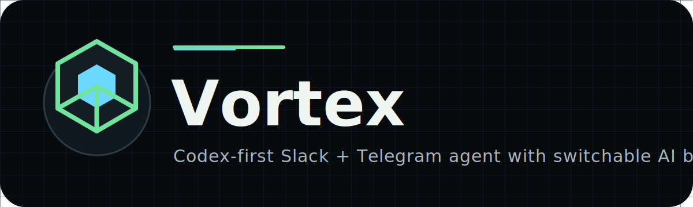

# Vortex



[](INSTALL-WINDOWS.md)
[](#slack-setup)
[](#telegram-setup)
[](LICENSE)

Run Codex from Telegram and Slack with one PowerShell command.

Vortex turns a Windows laptop into a personal AI command center: Telegram for phone control, Slack for team channels, and a local dashboard for choosing which AI brain handles each function.

Default behavior: Codex is the brain for everything. Users can still change the brain globally, or choose a different AI for Slack, Telegram, or later functions.

```powershell
powershell -ExecutionPolicy Bypass -Command "irm https://raw.githubusercontent.com/theaiboi365-hue/Vortex/main/scripts/setup-windows.ps1 | iex"
```

## Why This Exists

Most agent projects are powerful but heavy. This repo is designed around the shortest useful path:

1. Download with one command.
2. Open a local setup UI.
3. Paste Telegram and Slack tokens.
4. Message Codex from phone or team chat.
5. Route specific functions to Codex, Claude, OpenAI-compatible APIs, or Ollama.

## Launch Kit

- [Windows one-click setup](INSTALL-WINDOWS.md)
- [Press kit](docs/PRESS-KIT.md)
- [Launch plan](docs/LAUNCH-PLAN.md)
- [Demo script](docs/DEMO-SCRIPT.md)
- [Comparison page](docs/COMPARISONS.md)
- [Wikipedia-safe materials](docs/wikipedia/WIKIPEDIA-PLAN.md)
- [Release notes](RELEASE-NOTES-v1.0.0.md)
- [SEO plan](docs/SEO.md)

## What You Get

- Local setup dashboard at `http://127.0.0.1:8787`
- Codex as the default AI brain
- Per-function routing with `AI_PROVIDER`, `SLACK_AI_PROVIDER`, and `TELEGRAM_AI_PROVIDER`
- Optional Anthropic/Claude, OpenAI-compatible, and Ollama brains
- Telegram token UI with BotFather steps
- Slack token UI for `xoxb` bot tokens and `xapp` Socket Mode tokens
- Slack threaded replies by default
- Telegram `/start` and `/reset`
- Safe OpenClaw-style agent tools with `/tools`
- Approved commands for status, dashboard open, repo status, file list, and syntax checks
- Explicit-command safety: Vortex only acts when the user asks with a `vortex` command
- Safety blocks for banking/payment actions, secrets/tokens, private data leaks, and data-breach requests
- Per-thread local memory in `.data/threads.json`
- Windows install and startup scripts
- One-command Windows download installer
- Render worker deploy file
- GitHub Actions syntax check
- No secrets committed

## Search Phrases This Project Solves

- Run Codex from Telegram
- Run Codex from Slack
- Use Codex from phone
- Windows AI agent installer
- Telegram and Slack AI agent
- Codex command center with Ollama and Claude routing

## Compared With Other Agent Projects

| Project style | Main strength | Vortex difference |
| --- | --- | --- |
| OpenClaw-style agent UI | Broad agent workspace and polished UI | Focused chat bridge for Codex from Telegram and Slack |
| Hermes-style messaging agent | Messaging-first agent experience | Windows-first one-command install plus per-function AI routing |
| Generic Telegram bot | Simple phone chat | Codex default brain, Slack threading, local dashboard, and startup automation |
| Local Ollama chatbot | Cheap local inference | Can keep Codex for coding and use Ollama only where wanted |

## Quick Start

### Windows Download Installer

Open PowerShell and run:

```powershell
powershell -ExecutionPolicy Bypass -Command "irm https://raw.githubusercontent.com/theaiboi365-hue/Vortex/main/scripts/setup-windows.ps1 | iex"
```

This downloads the repo, installs dependencies, enables startup automation, creates a desktop launcher, starts the bot, and opens:

```text
http://127.0.0.1:8787
```

### Terminal Installation

For developers who prefer terminal setup:

```powershell
git clone https://github.com/theaiboi365-hue/Vortex.git
cd Vortex
npm.cmd install
Copy-Item .env.example .env
npm.cmd start
```

Then open:

```text
http://127.0.0.1:8787
```

### Git Clone

```powershell
git clone https://github.com/theaiboi365-hue/Vortex.git
cd Vortex
powershell -ExecutionPolicy Bypass -File .\scripts\install.ps1
npm.cmd start
```

Open:

```text
http://127.0.0.1:8787
```

Keep `AI_PROVIDER=codex`, paste Telegram/Slack tokens, save, then restart:

```powershell
npm.cmd start
```

## Brain Routing

Supported providers:

```env
AI_PROVIDER=codex
SLACK_AI_PROVIDER=
TELEGRAM_AI_PROVIDER=
```

Examples:

```env
# Codex handles everything
AI_PROVIDER=codex

# Codex handles default work, Telegram uses local Ollama
AI_PROVIDER=codex
TELEGRAM_AI_PROVIDER=ollama

# Slack uses Claude, Telegram uses Codex
SLACK_AI_PROVIDER=anthropic
TELEGRAM_AI_PROVIDER=codex
```

Supported provider names:

```text
codex
anthropic
claude
openai
openai-compatible
ollama
local
```

## Codex Brain

Codex is the default and uses the local Codex CLI:

```env
AI_PROVIDER=codex
CODEX_COMMAND=codex
CODEX_MODEL=
CODEX_EXTRA_ARGS=
```

The machine running the bot must have Codex installed and logged in. `CODEX_MODEL` is optional.

## Other Brains

Anthropic/Claude:

```env
ANTHROPIC_API_KEY=sk-ant-...
CLAUDE_MODEL=claude-3-5-sonnet-latest
```

OpenAI-compatible:

```env
OPENAI_API_KEY=sk-...
OPENAI_BASE_URL=https://api.openai.com/v1
OPENAI_MODEL=gpt-4.1-mini
```

Ollama:

```env
OLLAMA_BASE_URL=http://127.0.0.1:11434
OLLAMA_MODEL=gemma3:270m
```

## Telegram Setup

1. Open Telegram.
2. Search `@BotFather`.
3. Send `/newbot`.
4. Pick a bot name and username.
5. Copy the token.
6. Open the local dashboard.
7. Paste it into `Telegram bot token`.
8. Save and restart the bot.
9. Search your bot username in Telegram and press Start.

Optional lock-down:

```env
TELEGRAM_ALLOWED_USER_IDS=123456789,987654321
```

## Slack Setup

1. Create a Slack app at `https://api.slack.com/apps`.
2. Enable Socket Mode.
3. Create an app-level token with `connections:write`; this is the `xapp-...` token.
4. Add bot scopes such as `chat:write`, `channels:history`, `groups:history`, `im:history`, and `mpim:history`.
5. Install the app to your workspace.
6. Copy the bot token; this is the `xoxb-...` token.
7. Paste both Slack tokens in the local dashboard.
8. Save, restart, and invite the bot to a channel.

Optional lock-down:

```env
SLACK_ALLOWED_CHANNEL_IDS=C123456,C999999
SLACK_ALLOWED_USER_IDS=U123456,U999999
```

## Commands

```text
/start      Telegram welcome message
/reset      Clear Telegram chat memory
reset chat  Clear Slack thread memory
/tools      Show safe Vortex agent tools
vortex status
vortex open dashboard
vortex git status
vortex check
vortex files
```

## Environment

```env
AI_PROVIDER=codex
SLACK_AI_PROVIDER=
TELEGRAM_AI_PROVIDER=
CODEX_COMMAND=codex
CODEX_MODEL=
CODEX_EXTRA_ARGS=
ANTHROPIC_API_KEY=
CLAUDE_MODEL=claude-3-5-sonnet-latest
OPENAI_API_KEY=
OPENAI_BASE_URL=https://api.openai.com/v1
OPENAI_MODEL=gpt-4.1-mini
OLLAMA_BASE_URL=http://127.0.0.1:11434
OLLAMA_MODEL=gemma3:270m
DASHBOARD_PORT=8787
BOT_NAME=Vortex
SYSTEM_PROMPT=You are Codex, a concise, useful AI assistant inside Slack and Telegram.
MAX_HISTORY_MESSAGES=12
REPLY_IN_THREAD=true
AGENT_TOOLS_ENABLED=true
AGENT_MODE=safe
SLACK_BOT_TOKEN=xoxb-...
SLACK_APP_TOKEN=xapp-...
SLACK_SIGNING_SECRET=
SLACK_ALLOWED_CHANNEL_IDS=
SLACK_ALLOWED_USER_IDS=
TELEGRAM_BOT_TOKEN=123456:abc...
TELEGRAM_ALLOWED_USER_IDS=
```

## Run on Laptop Startup

```powershell
powershell -ExecutionPolicy Bypass -File .\scripts\make-startup-shortcut.ps1
```

For background start without keeping a PowerShell window open:

```powershell
powershell -ExecutionPolicy Bypass -File .\scripts\start-hidden.ps1
```

## Security

Never commit `.env`. If you paste a token in a public place, revoke it and create a new one. The dashboard writes tokens only to your local `.env` file.

## License

MIT
